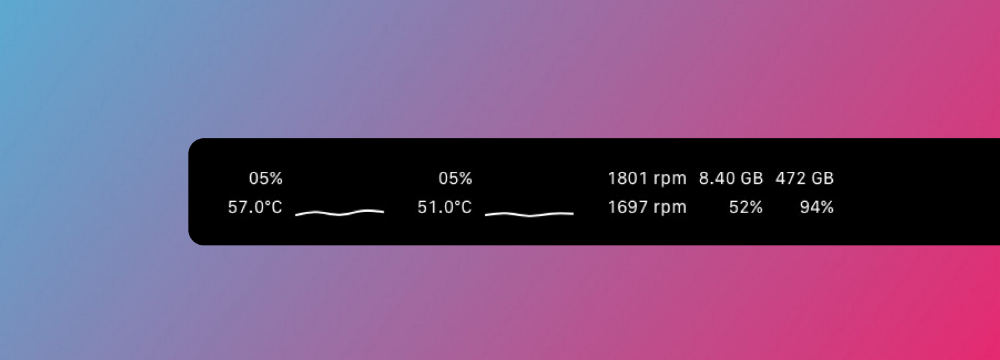

# oil 🛢️
A macOS monitoring widget for the [pock](https://github.com/pock/pock) touchbar, borrowing code and inspiration from the status bar of the [eul](https://github.com/gao-sun/eul) app.



## 📦 Installation
First, if you haven't, download the pock app.
```sh
brew install --cask pock
```
Then, download and open the `oil.zip` file from the releases. Navigate to the status bar and select "Pock > Install Widget". Choose the `oil.pock` that came from the zip file. With all that done, you should be able to see the widget within the pock customization panel when you select "Pock > Customize Pock". 

Additionally, the preferences panel in "Pock > Manage Widget" offers useful options if you would like to change the look of the widget.
